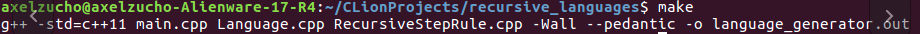
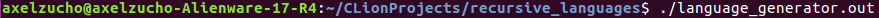
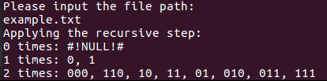

# Language Generator

## Usage

After downloading, run `make` in the downloaded directory.

After running it, you will find the executable 'language_generator.out'. To run it, execute the command `./language_generator.out`.

It will ask for the path of the input file. An example of a valid input is: `example.txt`.

You will then see the language generated. 

Each printed step will show you the **new strings** added to the language in that specific step.

## Input file format

The input file should have three different lines, each line should be as follows:

1. __Base case__: If you want to input the null character, you should 
write it as **"#!NULL!#"** (without the quotations). If you want to specify multiple base cases, you should separate each by a **comma** (i.e. `a,b`) and **no spaces**. 

2. __Recursive step rules__: Here you should input all the rules, separated by a **comma** and **no spaces**. The following list of characters is reserved for representations of the strings in the language: 

    * u
    * v
    * w
    * x
    * y
    * z

    All other characters will specify the specific character inputted. 
    For example the rule: `uva` will be treated as:
    * u: Will represent any string inside the language.
    * v: Will represent any string inside the language (can be different than 'u').
    * a: Will represent the character 'a'.

    So a valid input line for these rules would be: `uva,au,uavb,uau`

3. __Step number__: Here you should enter a single int which will specify the amount of recursive steps to execute. 
    
    For example: `3`

There is also an example of this format in the `example.txt` file in the project directory.    

 ## Author
 
 Axel Zuchovicki - ITESM CSF